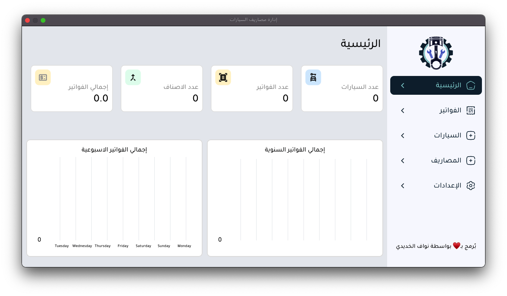
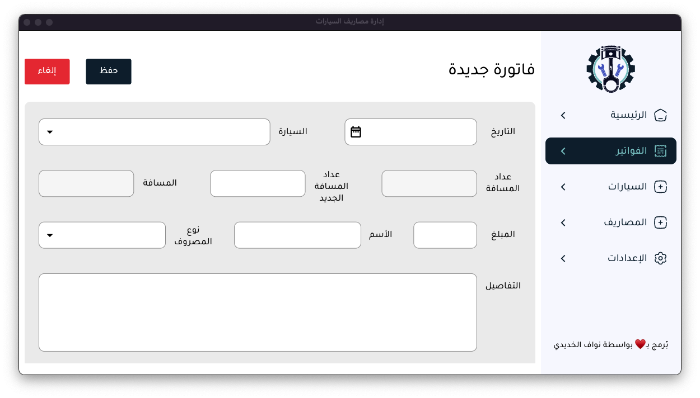

<p align="center">
    <a href="">
        
    </a>
</p>


# car_expense_management


This application helps in organizing and managing car expenses efficiently, making it easier for users to track all costs and information related to their cars.


<p align="center">
    <a href="">
        
    </a>
</p>

#  Sidebar Menu:

	•	Home
	•	Invoices
	•	Cars
	•	Expenses
	•	Settings

#  Key Features:

 	• Design with Flutter.
 	• For mac & windows.
    • Separate file for each page & component.
	• Riverpod for State Managment.
 	• Use of GetIt for DI.
 	• Code to be generic and simple.
	• Clean and simple design for easy interaction.
	• Distinctive colors to differentiate functional buttons.
	• Sidebar for easy navigation between different sections of the system.

# Core Functions:

	• Add car information.
	• Manage and record invoices related to expenses.
	• View and edit data related to cars, expenses, and invoices.


## Getting Started


# dependencies :

- flutter_animate: ^4.5.0
- flutter_svg: ^2.0.9
- get_it: ^7.6.7
- flutter_riverpod: ^2.4.10
- getwidget: ^4.0.0
- go_router: ^13.2.0 
- sqflite: ^2.3.2
- path: ^1.8.3
- intl: 
- syncfusion_flutter_datepicker: ^24.2.8
- syncfusion_flutter_datagrid: ^24.2.9
- collection: ^1.18.0
- syncfusion_flutter_core: ^24.2.9
- syncfusion_flutter_xlsio: ^24.2.9
- window_manager: ^0.3.8
- syncfusion_flutter_datagrid_export: ^24.2.9
- syncfusion_flutter_pdf: ^24.2.9
- path_provider: ^2.1.2
- fl_chart: ^0.67.0
- url_launcher: ^6.2.5
- flutter_launcher_icons: ^0.13.1
- pinput: ^4.0.0
  
 
  

## Installation :

1. clone the repository using the link below:
```
https://github.com/nawafAlkhadidi/cars_expense_management
```

2. run command below  in the terminal to get the required dependencies:
```
flutter pub get
```

3. Run the command below on the device you want to use :
```
flutter run
```
